<!-- SPDX-FileCopyrightText: Copyright (c) 2026 NVIDIA CORPORATION & AFFILIATES. All rights reserved. -->
<!-- SPDX-License-Identifier: Apache-2.0 -->

# CMake target dependency layers

Layered, **direct-dependency** view of this project's CMake targets, derived from live
CMake (`cmake --graphviz`). Targets are sorted into topological layers: a target sits one
layer above its deepest direct dependency, so no two targets in a layer depend on each
other and dependencies always point to lower layers.

> **Auto-generated -- do not edit the region between the markers below.**
> Regenerate by replacing this file with the `cmake-target-layers` artifact from the
> *Verify CMake target layers* CI run, or locally with the full CI toolchain via
> `python3 scripts/cmake_target_layers.py --preset ci-linux --write`.
> CI fails when the committed diagram drifts from what CMake reports.

<!-- BEGIN GENERATED: cmake-target-layers (do not edit by hand) -->

## Overview

- **64** targets, **103** direct dependencies, **8** layers.
- Generated from configure preset `ci-linux` (see `CMakePresets.json`).
- Layer *k* contains targets whose deepest direct-dependency chain is *k* long; every dependency points to a strictly lower layer, so there are **no edges within a layer**. This is a layered DAG (shared foundations create diamonds), not a strict tree.
- Raw system library links (`-ldl`, `-lstdc++fs`, …) are omitted: CMake records them as *Unknown library* nodes (not real CMake targets) and they carry no structural information about module boundaries.
- Third-party nodes that no first-party target links directly are omitted (e.g. `pybind11::pybind11`, `Catch2`, `ProjectConfig`). Only the top-level API surface that this project actually links against is shown; internal sub-targets of third-party packages are implementation details of those packages. A small set of individually-named build-machinery targets (see `HIDDEN_TARGETS` in the generator script) are also omitted — these are programmatically injected by CMake helper functions and do not represent user-authored dependency choices.
- **Transitive reduction applied:** edges that are already implied by a longer dependency path are omitted (e.g. if A → B → C, the redundant A → C edge is dropped). The graph has the same reachability as the raw CMake declarations; see the `CMakeLists.txt` files for every declared `target_link_libraries` call.

### Legend

- Node shape: `([executable])`, `[static / shared library]`, `[[module library]]`, `{{interface library}}`, `[/object library/]`, `[custom target]`.
- Node colour: blue = first-party target, grey = third-party dependency.
- Arrow `A --> B` means **A depends on B** (B is in a lower layer).
- Link visibility (`public` / `private` / `interface`) is listed in the per-target table below.

## Layered dependency graph

```mermaid
%%{init: {"flowchart": {"rankSpacing": 120}, "themeVariables": {"fontSize": "24pt"}} }%%
flowchart TD
  subgraph LYR7["Layer 7 - top (consumers)"]
    n53(["viz_layers_tests"])
    n56(["viz_session_tests"])
    n13[["deviceio_session_py"]]
  end
  subgraph LYR6["Layer 6"]
    n52["viz::layers_testing"]
    n54[["viz_py"]]
    n11{{"deviceio::deviceio_py_utils"}}
    n8(["controller_synthetic_hands"])
    n18(["frame_metadata_printer"])
    n29(["mcap_tests"])
    n33(["oxr_session_sharing"])
    n34(["oxr_simple_api_demo"])
    n36(["pedal_printer"])
    n41(["replay_deviceio_session_tests"])
    n48(["teleop_ros2_mcap_generator"])
  end
  subgraph LYR5["Layer 5"]
    n51["viz::layers"]
    n12["deviceio::deviceio_session"]
  end
  subgraph LYR4["Layer 4"]
    n55["viz::session"]
    n61(["viz_xr_tests"])
    n50(["viz_core_tests"])
    n25["deviceio::live_trackers"]
    n42["deviceio::replay_trackers"]
    n15[["deviceio_trackers_py"]]
  end
  subgraph LYR3["Layer 3"]
    n7(["camera_plugin_oak"])
    n19(["generic_3axis_pedal_plugin"])
    n37(["pedal_pusher"])
    n32[["oxr_py"]]
    n60["viz::xr"]
    n59{{"viz::test_support"}}
    n62(["xdev_list"])
    n14["deviceio::deviceio_trackers"]
  end
  subgraph LYR2["Layer 2"]
    n9["depthai::core"]
    n39["pusherio::pusherio"]
    n31["oxr::oxr_core"]
    n47["Teleop::plugin_utils"]
    n49["viz::core"]
    n16["examples_common"]
    n10{{"deviceio::deviceio_base"}}
    n27{{"mcap::mcap_core"}}
    n43[["schema_py"]]
    n44(["schema_tests"])
    n38[["plugin_manager_py"]]
    n58(["viz_shaders_tests"])
  end
  subgraph LYR1["Layer 1"]
    n4["XLink"]
    n6["archive_static"]
    n35{{"oxr::oxr_utils"}}
    n30["OpenXR::openxr_loader"]
    n23{{"isaacteleop_schema"}}
    n20["glfw"]
    n46["teleop_plugin_manager"]
    n1["Catch2::Catch2WithMain"]
  end
  subgraph LYR0["Layer 0 - foundation"]
    n5{{"XLinkPublic"}}
    n26["lzma::lzma"]
    n22{{"OpenXR::headers"}}
    n17["flatbuffers"]
    n3{{"Threads::Threads"}}
    n63["yaml-cpp::yaml-cpp"]
    n0["Catch2::Catch2"]
    n2["SDL2::SDL2-static"]
    n21{{"glm::glm"}}
    n24{{"libnop"}}
    n28{{"mcap::mcap"}}
    n40{{"pybind11::module"}}
    n45{{"Teleop::openxr_extensions"}}
    n57{{"viz::shaders"}}
  end
  n1 --> n0
  n4 --> n5
  n6 --> n26
  n7 --> n2
  n7 --> n9
  n7 --> n23
  n7 --> n28
  n7 --> n31
  n7 --> n39
  n8 --> n12
  n8 --> n31
  n8 --> n47
  n9 --> n3
  n9 --> n4
  n9 --> n6
  n9 --> n24
  n10 --> n23
  n11 --> n12
  n12 --> n25
  n12 --> n42
  n13 --> n11
  n13 --> n40
  n14 --> n10
  n15 --> n14
  n15 --> n40
  n16 --> n30
  n18 --> n12
  n18 --> n31
  n19 --> n23
  n19 --> n31
  n19 --> n39
  n20 --> n3
  n23 --> n17
  n25 --> n14
  n25 --> n27
  n25 --> n35
  n25 --> n45
  n27 --> n23
  n27 --> n28
  n29 --> n1
  n29 --> n12
  n30 --> n3
  n30 --> n22
  n31 --> n30
  n31 --> n35
  n32 --> n31
  n32 --> n40
  n33 --> n12
  n33 --> n31
  n34 --> n12
  n34 --> n31
  n35 --> n22
  n36 --> n12
  n36 --> n31
  n37 --> n23
  n37 --> n31
  n37 --> n39
  n38 --> n40
  n38 --> n46
  n39 --> n35
  n39 --> n45
  n41 --> n1
  n41 --> n12
  n42 --> n14
  n42 --> n27
  n43 --> n23
  n43 --> n40
  n44 --> n1
  n44 --> n22
  n44 --> n23
  n46 --> n3
  n46 --> n63
  n47 --> n30
  n47 --> n35
  n47 --> n45
  n48 --> n12
  n49 --> n21
  n49 --> n30
  n50 --> n1
  n50 --> n59
  n51 --> n55
  n51 --> n57
  n52 --> n51
  n53 --> n1
  n53 --> n52
  n53 --> n59
  n54 --> n40
  n54 --> n51
  n55 --> n20
  n55 --> n35
  n55 --> n60
  n56 --> n1
  n56 --> n52
  n56 --> n59
  n58 --> n1
  n58 --> n57
  n59 --> n0
  n59 --> n49
  n60 --> n49
  n61 --> n1
  n61 --> n60
  n62 --> n16
  n62 --> n45
  classDef firstparty fill:#d9e8fb,stroke:#3b73b9,color:#0b2545;
  classDef thirdparty fill:#ededed,stroke:#9a9a9a,color:#333333;
  class n10,n11,n12,n13,n14,n15,n16,n18,n19,n23,n24,n25,n27,n28,n29,n31,n32,n33,n34,n35,n36,n37,n38,n39,n4,n41,n42,n43,n44,n45,n46,n47,n48,n49,n5,n50,n51,n52,n53,n54,n55,n56,n57,n58,n59,n6,n60,n61,n62,n7,n8 firstparty
  class n0,n1,n17,n2,n20,n21,n22,n26,n3,n30,n40,n63,n9 thirdparty
```

## Layers

| Layer | Targets |
| ----: | ------- |
| 7 | `viz_layers_tests`, `viz_session_tests`, `deviceio_session_py` |
| 6 | `viz::layers_testing`, `viz_py`, `deviceio::deviceio_py_utils`, `controller_synthetic_hands`, `frame_metadata_printer`, `mcap_tests`, `oxr_session_sharing`, `oxr_simple_api_demo`, `pedal_printer`, `replay_deviceio_session_tests`, `teleop_ros2_mcap_generator` |
| 5 | `viz::layers`, `deviceio::deviceio_session` |
| 4 | `viz::session`, `viz_xr_tests`, `viz_core_tests`, `deviceio::live_trackers`, `deviceio::replay_trackers`, `deviceio_trackers_py` |
| 3 | `camera_plugin_oak`, `generic_3axis_pedal_plugin`, `pedal_pusher`, `oxr_py`, `viz::xr`, `viz::test_support`, `xdev_list`, `deviceio::deviceio_trackers` |
| 2 | `depthai::core`, `pusherio::pusherio`, `oxr::oxr_core`, `Teleop::plugin_utils`, `viz::core`, `examples_common`, `deviceio::deviceio_base`, `mcap::mcap_core`, `schema_py`, `schema_tests`, `plugin_manager_py`, `viz_shaders_tests` |
| 1 | `XLink`, `archive_static`, `oxr::oxr_utils`, `OpenXR::openxr_loader`, `isaacteleop_schema`, `glfw`, `teleop_plugin_manager`, `Catch2::Catch2WithMain` |
| 0 | `XLinkPublic`, `lzma::lzma`, `OpenXR::headers`, `flatbuffers`, `Threads::Threads`, `yaml-cpp::yaml-cpp`, `Catch2::Catch2`, `SDL2::SDL2-static`, `glm::glm`, `libnop`, `mcap::mcap`, `pybind11::module`, `Teleop::openxr_extensions`, `viz::shaders` |

## Direct dependencies by target

| Target | Type | Origin | Layer | Direct dependencies |
| ------ | ---- | ------ | ----: | ------------------- |
| `Catch2::Catch2` | Static library | third-party | 0 | _(none)_ |
| `Catch2::Catch2WithMain` | Static library | third-party | 1 | `Catch2::Catch2` (public) |
| `SDL2::SDL2-static` | Static library | third-party | 0 | _(none)_ |
| `Threads::Threads` | Interface library | third-party | 0 | _(none)_ |
| `XLink` | Static library | first-party | 1 | `XLinkPublic` (interface) |
| `XLinkPublic` | Interface library | first-party | 0 | _(none)_ |
| `archive_static` | Static library | first-party | 1 | `lzma::lzma` (interface) |
| `camera_plugin_oak` | Executable | first-party | 3 | `SDL2::SDL2-static` (private), `depthai::core` (private), `isaacteleop_schema` (private), `mcap::mcap` (private), `oxr::oxr_core` (private), `pusherio::pusherio` (private) |
| `controller_synthetic_hands` | Executable | first-party | 6 | `deviceio::deviceio_session` (private), `oxr::oxr_core` (private), `Teleop::plugin_utils` (private) |
| `depthai::core` | Static library | third-party | 2 | `Threads::Threads` (private), `XLink` (private), `archive_static` (private), `libnop` (public) |
| `deviceio::deviceio_base` | Interface library | first-party | 2 | `isaacteleop_schema` (interface) |
| `deviceio::deviceio_py_utils` | Interface library | first-party | 6 | `deviceio::deviceio_session` (interface) |
| `deviceio::deviceio_session` | Static library | first-party | 5 | `deviceio::live_trackers` (private), `deviceio::replay_trackers` (private) |
| `deviceio_session_py` | Module library | first-party | 7 | `deviceio::deviceio_py_utils` (private), `pybind11::module` (private) |
| `deviceio::deviceio_trackers` | Static library | first-party | 3 | `deviceio::deviceio_base` (public) |
| `deviceio_trackers_py` | Module library | first-party | 4 | `deviceio::deviceio_trackers` (private), `pybind11::module` (private) |
| `examples_common` | Static library | first-party | 2 | `OpenXR::openxr_loader` (public) |
| `flatbuffers` | Static library | third-party | 0 | _(none)_ |
| `frame_metadata_printer` | Executable | first-party | 6 | `deviceio::deviceio_session` (private), `oxr::oxr_core` (private) |
| `generic_3axis_pedal_plugin` | Executable | first-party | 3 | `isaacteleop_schema` (private), `oxr::oxr_core` (private), `pusherio::pusherio` (private) |
| `glfw` | Static library | third-party | 1 | `Threads::Threads` (private) |
| `glm::glm` | Interface library | third-party | 0 | _(none)_ |
| `OpenXR::headers` | Interface library | third-party | 0 | _(none)_ |
| `isaacteleop_schema` | Interface library | first-party | 1 | `flatbuffers` (interface) |
| `libnop` | Interface library | first-party | 0 | _(none)_ |
| `deviceio::live_trackers` | Static library | first-party | 4 | `deviceio::deviceio_trackers` (public), `mcap::mcap_core` (public), `oxr::oxr_utils` (public), `Teleop::openxr_extensions` (public) |
| `lzma::lzma` | Static library | third-party | 0 | _(none)_ |
| `mcap::mcap_core` | Interface library | first-party | 2 | `isaacteleop_schema` (interface), `mcap::mcap` (interface) |
| `mcap::mcap` | Interface library | first-party | 0 | _(none)_ |
| `mcap_tests` | Executable | first-party | 6 | `Catch2::Catch2WithMain` (private), `deviceio::deviceio_session` (private) |
| `OpenXR::openxr_loader` | Static library | third-party | 1 | `Threads::Threads` (public), `OpenXR::headers` (public) |
| `oxr::oxr_core` | Static library | first-party | 2 | `OpenXR::openxr_loader` (public), `oxr::oxr_utils` (public) |
| `oxr_py` | Module library | first-party | 3 | `oxr::oxr_core` (private), `pybind11::module` (private) |
| `oxr_session_sharing` | Executable | first-party | 6 | `deviceio::deviceio_session` (private), `oxr::oxr_core` (private) |
| `oxr_simple_api_demo` | Executable | first-party | 6 | `deviceio::deviceio_session` (private), `oxr::oxr_core` (private) |
| `oxr::oxr_utils` | Interface library | first-party | 1 | `OpenXR::headers` (interface) |
| `pedal_printer` | Executable | first-party | 6 | `deviceio::deviceio_session` (private), `oxr::oxr_core` (private) |
| `pedal_pusher` | Executable | first-party | 3 | `isaacteleop_schema` (private), `oxr::oxr_core` (private), `pusherio::pusherio` (private) |
| `plugin_manager_py` | Module library | first-party | 2 | `pybind11::module` (private), `teleop_plugin_manager` (private) |
| `pusherio::pusherio` | Static library | first-party | 2 | `oxr::oxr_utils` (public), `Teleop::openxr_extensions` (public) |
| `pybind11::module` | Interface library | third-party | 0 | _(none)_ |
| `replay_deviceio_session_tests` | Executable | first-party | 6 | `Catch2::Catch2WithMain` (private), `deviceio::deviceio_session` (private) |
| `deviceio::replay_trackers` | Static library | first-party | 4 | `deviceio::deviceio_trackers` (public), `mcap::mcap_core` (public) |
| `schema_py` | Module library | first-party | 2 | `isaacteleop_schema` (private), `pybind11::module` (private) |
| `schema_tests` | Executable | first-party | 2 | `Catch2::Catch2WithMain` (private), `OpenXR::headers` (private), `isaacteleop_schema` (private) |
| `Teleop::openxr_extensions` | Interface library | first-party | 0 | _(none)_ |
| `teleop_plugin_manager` | Static library | first-party | 1 | `Threads::Threads` (public), `yaml-cpp::yaml-cpp` (private) |
| `Teleop::plugin_utils` | Static library | first-party | 2 | `OpenXR::openxr_loader` (public), `oxr::oxr_utils` (public), `Teleop::openxr_extensions` (public) |
| `teleop_ros2_mcap_generator` | Executable | first-party | 6 | `deviceio::deviceio_session` (private) |
| `viz::core` | Static library | first-party | 2 | `glm::glm` (public), `OpenXR::openxr_loader` (public) |
| `viz_core_tests` | Executable | first-party | 4 | `Catch2::Catch2WithMain` (private), `viz::test_support` (private) |
| `viz::layers` | Static library | first-party | 5 | `viz::session` (public), `viz::shaders` (private) |
| `viz::layers_testing` | Static library | first-party | 6 | `viz::layers` (public) |
| `viz_layers_tests` | Executable | first-party | 7 | `Catch2::Catch2WithMain` (private), `viz::layers_testing` (private), `viz::test_support` (private) |
| `viz_py` | Module library | first-party | 6 | `pybind11::module` (private), `viz::layers` (private) |
| `viz::session` | Static library | first-party | 4 | `glfw` (public), `oxr::oxr_utils` (public), `viz::xr` (public) |
| `viz_session_tests` | Executable | first-party | 7 | `Catch2::Catch2WithMain` (private), `viz::layers_testing` (private), `viz::test_support` (private) |
| `viz::shaders` | Interface library | first-party | 0 | _(none)_ |
| `viz_shaders_tests` | Executable | first-party | 2 | `Catch2::Catch2WithMain` (private), `viz::shaders` (private) |
| `viz::test_support` | Interface library | first-party | 3 | `Catch2::Catch2` (interface), `viz::core` (interface) |
| `viz::xr` | Static library | first-party | 3 | `viz::core` (public) |
| `viz_xr_tests` | Executable | first-party | 4 | `Catch2::Catch2WithMain` (private), `viz::xr` (private) |
| `xdev_list` | Executable | first-party | 3 | `examples_common` (private), `Teleop::openxr_extensions` (private) |
| `yaml-cpp::yaml-cpp` | Static library | third-party | 0 | _(none)_ |

<!-- END GENERATED: cmake-target-layers -->
